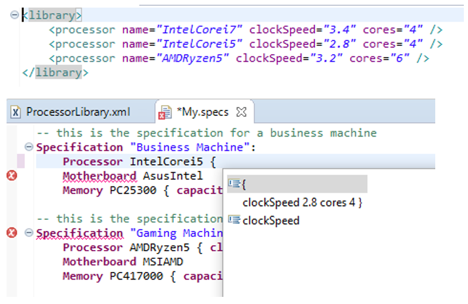

# SpecsDsl

A quick, simple example of how to reference XML models from an Xtext DSL.

This DSL allows a user to specify the specifications of different computer systems (note this DSL is entirely useless, it is only meant to be a simple example to show a strategy of how Xtext DSLs can reference XML models. Custom content assist proposals (which use data captured from the XML models) are also implemented. 

Example:

 

## Getting Started
To run the example, simply clone the repo. Import all Eclipse projects contained under the plugins directory and run a new runtime instance of Eclipse.
In the runtime instance, import the project under the example directory
## Notes 
The example was created using the following process:
1.	Implement an EMF representation of the XML model (com.example.library plug-in). 
2.	Implement a Model-To-Model (M2M) transformation to transform the EMF model into an XML model (com.example.m2m plug-in).
3.	Implement an Eclipse builder to automate the M2M transformation (com.example.specs.builder plug-in)
4.	Create Xtext grammar that references the EMF representation (com.example.specs plug-in)
5.	Create an Eclipse plug-in to make Xtext aware of the EMF models (com.example.specs.library plug-in)
6.	Modify content assist to provide more useful proposals (com.example.specs.ui plug-in)

